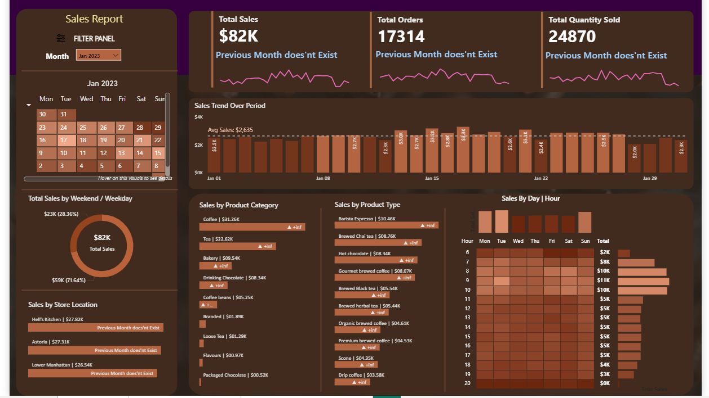

# ☕ Coffee Sales Dashboard (Power BI + SQL)

## 📊 Project Overview
This project demonstrates **Coffee Sales Analysis** using **Power BI** and **SQL**.  
The goal is to provide clear insights into sales performance, customer trends, and regional revenue distribution.  

The dashboard highlights:
- Total Sales, Quantity, and Profit  
- Top-selling coffee products  
- Regional performance  
- Customer purchase patterns  
- Monthly/Yearly sales trends  

---

## 📂 Repository Structure
'''
Coffee-Sales-Dashboard/
│── CoffeeSalesDashBoard (1).pbix # Power BI interactive dashboard
│── MY SQL Queries.docx.pdf # SQL report with queries & analysis
│── Coffee Shop Sales(Transactions).csv # Dataset used for analysis
│── Dashboard-SS.png # Dashboard screenshot (preview)
│── README.md # Documentation
'''
---

## 📷 Dashboard Preview
Here’s a snapshot of the Power BI dashboard:  



---

## 🛠 Tools & Technologies
- **Power BI** → Data visualization and interactive reporting  
- **SQL (MySQL/PostgreSQL)** → Data extraction and analysis  
- **CSV dataset** → Transactional coffee shop sales data  
- **MS Word / PDF** → SQL report documentation  

---

## 📥 How to Use
1. Clone this repository:
   ```bash
   git clone https://github.com/kfaiz8/coffee-sales-dashboard.git
Open the dataset Coffee Shop Sales(Transactions).csv in your SQL environment for queries.

Open CoffeeSalesDashBoard (1).pbix in Power BI Desktop to explore the interactive dashboard.

Read the SQL queries & findings in MY SQL Queries.docx.pdf.

📈 Insights from Dashboard
Identifies top-performing products driving revenue.

Tracks monthly sales growth and seasonality.

Compares regional performance to find strong and weak markets.

Analyzes customer buying trends for decision-making.
